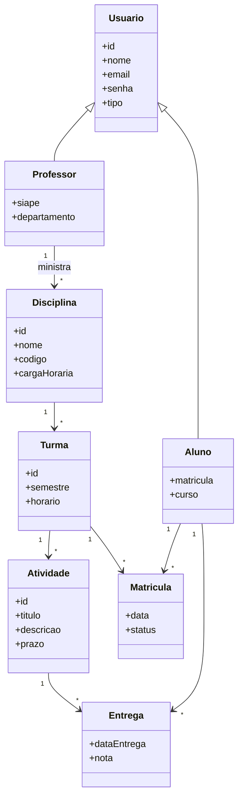

# Modelo Conceitual

## Diagrama de Classes (Modelo Conceitual)

## Entidades

### 1. Usuario
Entidade base que representa qualquer usuário do sistema.

| Campo | Tipo | Restrições | Descrição |
|-------|------|------------|-----------|
| `id` | INTEGER | PK, AUTO_INCREMENT | Identificador único |
| `nome` | VARCHAR(255) | NOT NULL | Nome completo |
| `email` | VARCHAR(255) | NOT NULL, UNIQUE | Email de login |
| `senha` | VARCHAR(255) | NOT NULL | Senha (hash bcrypt) |
| `tipo` | ENUM('aluno', 'professor', 'admin') | NOT NULL | Tipo de usuário |
| `created_at` | TIMESTAMP | DEFAULT NOW() | Data de criação |
| `updated_at` | TIMESTAMP | DEFAULT NOW() | Última atualização |

### 2. Aluno
Extensão do usuário para dados específicos do aluno.

| Campo | Tipo | Restrições | Descrição |
|-------|------|------------|-----------|
| `id` | INTEGER | PK, AUTO_INCREMENT | Identificador único |
| `usuario_id` | INTEGER | FK → Usuario.id, UNIQUE | Referência ao usuário |
| `matricula` | VARCHAR(50) | NOT NULL, UNIQUE | Número de matrícula |
| `curso` | VARCHAR(255) | NOT NULL | Curso do aluno |

### 3. Professor
Extensão do usuário para dados específicos do professor.

| Campo | Tipo | Restrições | Descrição |
|-------|------|------------|-----------|
| `id` | INTEGER | PK, AUTO_INCREMENT | Identificador único |
| `usuario_id` | INTEGER | FK → Usuario.id, UNIQUE | Referência ao usuário |
| `siape` | VARCHAR(50) | NOT NULL, UNIQUE | Código SIAPE |
| `departamento` | VARCHAR(255) | NOT NULL | Departamento do professor |

### 4. Disciplina
Representa uma disciplina acadêmica.

| Campo | Tipo | Restrições | Descrição |
|-------|------|------------|-----------|
| `id` | INTEGER | PK, AUTO_INCREMENT | Identificador único |
| `nome` | VARCHAR(255) | NOT NULL | Nome da disciplina |
| `codigo` | VARCHAR(20) | NOT NULL, UNIQUE | Código da disciplina |
| `carga_horaria` | INTEGER | NOT NULL | Carga horária em horas |

### 5. Turma
Instância de uma disciplina em um semestre específico.

| Campo | Tipo | Restrições | Descrição |
|-------|------|------------|-----------|
| `id` | INTEGER | PK, AUTO_INCREMENT | Identificador único |
| `disciplina_id` | INTEGER | FK → Disciplina.id | Disciplina associada |
| `professor_id` | INTEGER | NOT NULL | ID do professor (do auth-service) |
| `semestre` | VARCHAR(10) | NOT NULL | Semestre (ex: "2026.1") |
| `horario` | VARCHAR(100) | NOT NULL | Horário das aulas |

### 6. Matricula
Vínculo entre aluno e turma.

| Campo | Tipo | Restrições | Descrição |
|-------|------|------------|-----------|
| `id` | INTEGER | PK, AUTO_INCREMENT | Identificador único |
| `aluno_id` | INTEGER | NOT NULL | ID do aluno (do auth-service) |
| `turma_id` | INTEGER | FK → Turma.id | Turma associada |
| `data` | DATE | NOT NULL, DEFAULT NOW() | Data da matrícula |
| `status` | ENUM('ativa', 'trancada', 'concluida') | DEFAULT 'ativa' | Status da matrícula |

### 7. Atividade
Atividade associada a uma turma.

| Campo | Tipo | Restrições | Descrição |
|-------|------|------------|-----------|
| `id` | INTEGER | PK, AUTO_INCREMENT | Identificador único |
| `turma_id` | INTEGER | NOT NULL | ID da turma (do academic-service) |
| `titulo` | VARCHAR(255) | NOT NULL | Título da atividade |
| `descricao` | TEXT | | Descrição detalhada |
| `prazo` | DATE | NOT NULL | Prazo de entrega |

### 8. Entrega
Submissão de um aluno para uma atividade.

| Campo | Tipo | Restrições | Descrição |
|-------|------|------------|-----------|
| `id` | INTEGER | PK, AUTO_INCREMENT | Identificador único |
| `atividade_id` | INTEGER | FK → Atividade.id | Atividade associada |
| `aluno_id` | INTEGER | NOT NULL | ID do aluno (do auth-service) |
| `data_entrega` | TIMESTAMP | DEFAULT NOW() | Data/hora da submissão |
| `nota` | DECIMAL(5,2) | NULLABLE | Nota atribuída (0-10) |

## Relacionamentos

| Origem | Destino | Cardinalidade | Descrição |
|--------|---------|---------------|-----------|
| Usuario | Aluno | 1:1 | Um usuário pode ser um aluno |
| Usuario | Professor | 1:1 | Um usuário pode ser um professor |
| Professor | Turma | 1:N | Professor ministra várias turmas |
| Disciplina | Turma | 1:N | Disciplina tem várias turmas |
| Aluno | Matricula | 1:N | Aluno faz várias matrículas |
| Turma | Matricula | 1:N | Turma recebe vários alunos |
| Turma | Atividade | 1:N | Turma possui várias atividades |
| Atividade | Entrega | 1:N | Atividade recebe várias entregas |
| Aluno | Entrega | 1:N | Aluno submete várias entregas |

## Distribuição por Microsserviço

### auth-service (auth-db)
- `users` (Usuario)
- `alunos` (Aluno)
- `professores` (Professor)

### academic-service (academic-db)
- `disciplinas` (Disciplina)
- `turmas` (Turma)
- `matriculas` (Matricula)

### assignment-service (assignment-db)
- `atividades` (Atividade)
- `entregas` (Entrega)

> **Nota**: Os campos `professor_id` em Turma, `aluno_id` em Matricula/Entrega e `turma_id` em Atividade são referências lógicas (não FK de banco) entre serviços. A consistência é garantida via validação na camada de aplicação.
